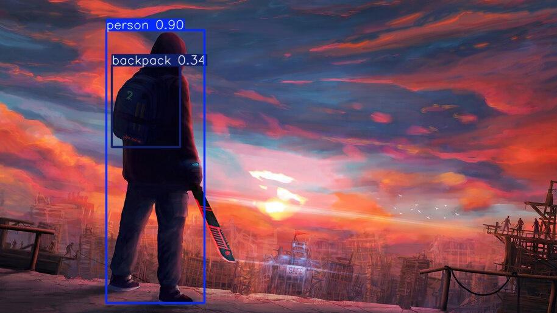

# KOSAI Computer Vision Application

A modern desktop application for real-time object detection using computer vision techniques.



## Features

- Real-time object detection using pre-trained models
- Works with images or webcam input
- Modern, user-friendly interface
- Detection results displayed in an interactive table
- Ability to save detection images automatically
- Confidence-based color coding of detection results

## Requirements

- Python 3.7+
- PyQt5
- OpenCV
- PyTorch
- Ultralytics YOLOv5

## Installation

1. Clone this repository or download the source code.

2. Install the required dependencies:

```bash
pip install -r requirements.txt
```

3. Run the application:

```bash
python KOSAIComputerVisionApp.py
```

## Usage

### Loading Images

1. Click the "Select Image" button to choose an image from your computer
2. The application will process the image and show the detection results
3. Both the original and detection result images will be displayed
4. Detection results will be shown in the table on the right

### Using Webcam

1. Select a camera from the dropdown menu
2. Click "Start Webcam" to begin real-time object detection
3. Adjust the save interval if you want to automatically save detection frames
4. Click "Stop" to end the webcam detection session

## How It Works

The application uses a state-of-the-art object detection model to identify and locate objects in images or video streams. The detection process follows these steps:

1. Input frame is captured from an image file or webcam
2. The frame is processed by the detection model
3. Detection results are visualized on the image and displayed in the application
4. Results are also presented in a table with confidence levels

## Project Structure

- `KOSAIComputerVisionApp.py` - The main application file
- `detection_results/` - Directory where detection images are saved
- `result.jpg` - The latest processed image result

## Customization

You can customize various aspects of the application:

- Adjust the save interval for automatic saving of detection frames
- Enable/disable saving detection images
- The application uses a modern theme with clean visuals

## License

This project is licensed under the MIT License - see the LICENSE file for details.

## Acknowledgments

- This application uses the YOLOv5 model for object detection
- Built with PyQt5 for a cross-platform desktop experience
- OpenCV is used for image processing

---

Developed by KOSAI Computer Vision Team. 